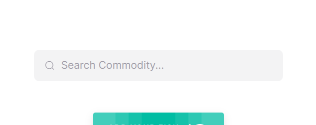
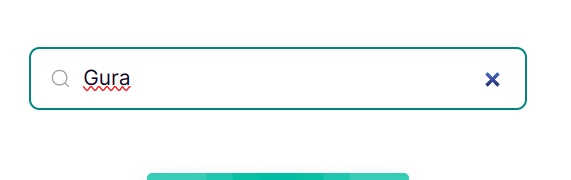
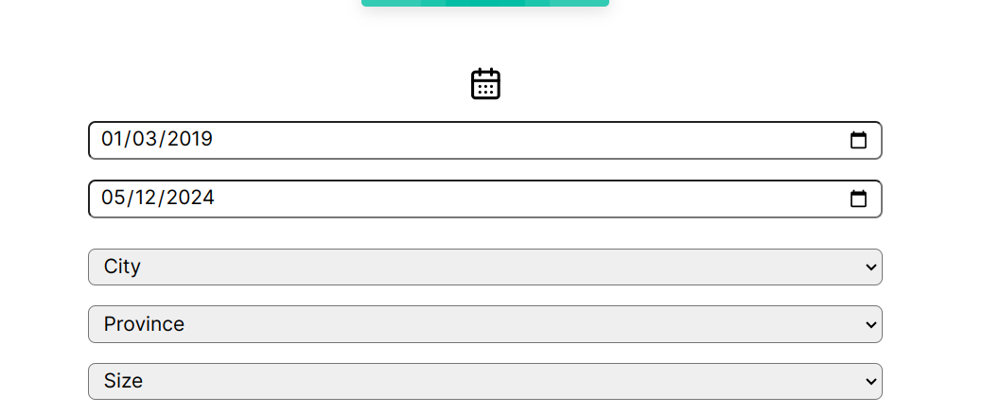
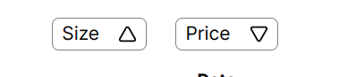
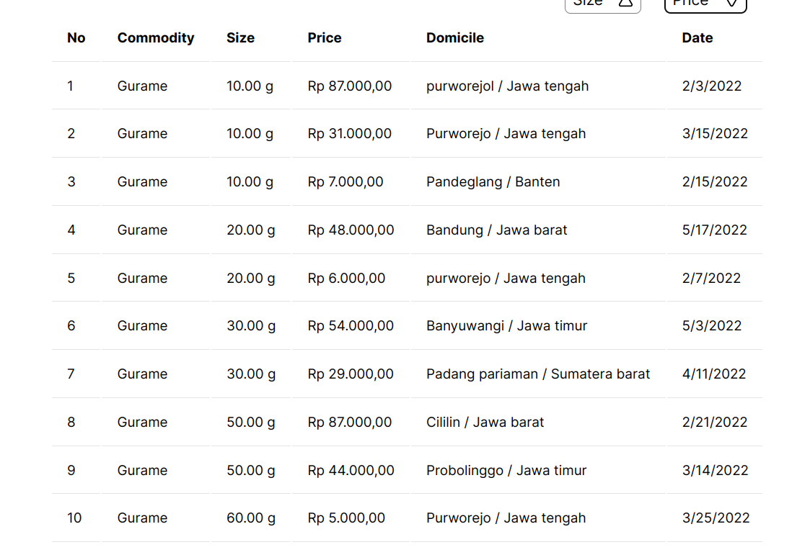
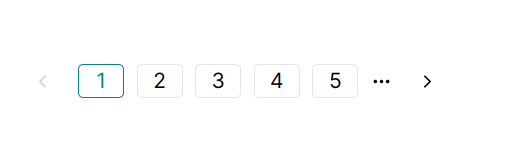
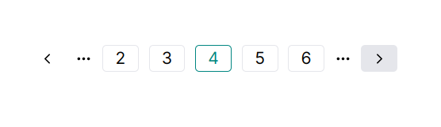
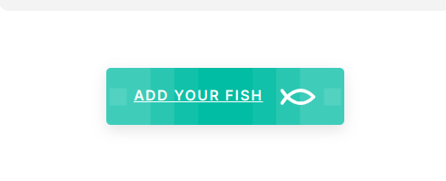
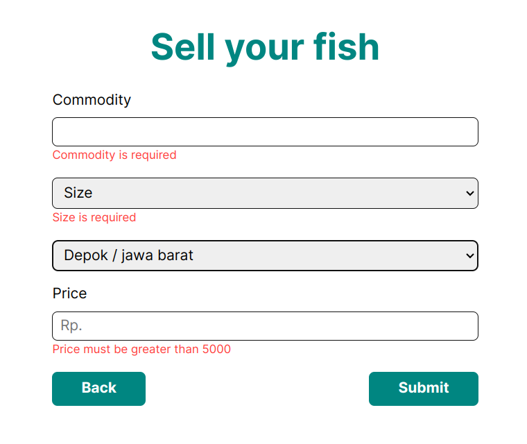

## Explanation
I made a Front-end app using React, Typescript, and SCSS, for managing fish price in Indonesia (dummy).

## Features
It have basic functionality for read and write, sorting, filtering and Searcing.

## Search Bar
At the top of the page, you can find a search bar used for searching the data by commodity.

  
  

## Filtering
You can filter data by date in a certain period, by city, province, and fish sizes.

  

## Sorting
You can sort sizes and prices in ascending or descending order using two toggle buttons.

  

## Table
The data is displayed in a nice, simple table. The data has been parsed and formatted so that the user can easily understand it.

  

## Pagination
The table is served along with pagination that serves 10 data per page. This will actually prevent the user from feeling overwhelmed.

  
  

### Adding Data
Users can add new data by navigating to the `/form` page and providing the necessary information.

  
  

